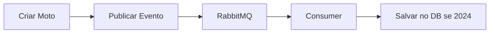

# Motorcycle Rental API - Desafio Backend Mottu

API para gerenciamento de aluguel de motos e entregadores, desenvolvida em .NET 9 com Clean Architecture + DDD + Event-Driven Architecture.

## 🚀 Tecnologias

- **.NET 9.0** - Framework principal
- **PostgreSQL** - Banco de dados principal  
- **Entity Framework Core 9** - ORM
- **RabbitMQ** - Sistema de mensageria para eventos
- **FluentValidation** - Validação de dados
- **Serilog** - Sistema de logs estruturados
- **Polly** - Retry Policy para resiliência
- **Swagger/OpenAPI** - Documentação da API
- **Docker & Docker Compose** - Containerização

## 🏗️ Arquitetura

O projeto segue os princípios de **Clean Architecture**, **Domain-Driven Design (DDD)** e **Event-Driven Architecture**:

```
MotorcycleRental/
├── src/
│   ├── MotorcycleRental.Domain/        # Camada de domínio (entidades, VOs, interfaces)
│   ├── MotorcycleRental.Application/   # Camada de aplicação (services, DTOs, validators)
│   ├── MotorcycleRental.Infrastructure/# Camada de infraestrutura (DB, repositories, messaging)
│   └── MotorcycleRental.Api/           # Camada de apresentação (controllers, middleware)
├── docker-compose.yml                  # Infraestrutura completa (PostgreSQL + RabbitMQ + pgAdmin)
└── README.md
```

### 📐 Camadas da Arquitetura

- **Domain**: Entidades, Value Objects, Interfaces, Eventos de domínio
- **Application**: Services, DTOs, Validators, Casos de uso
- **Infrastructure**: Repositórios, Mensageria, Storage, Configurações
- **API**: Controllers, Middleware, Configuração da aplicação

## 📋 Pré-requisitos

- .NET 9.0 SDK
- Docker e Docker Compose
- Visual Studio 2022 ou VS Code

## 🔧 Configuração e Instalação

### 1. Clone o repositório
```bash
git clone [url-do-repositorio](https://github.com/Algorithimo/Desafio-BackEndMottu.git)
cd MotorcycleRental
```

### 2. Subir a infraestrutura completa
```bash
# Inicia PostgreSQL, RabbitMQ e pgAdmin
docker-compose up -d

# Verificar se todos os serviços estão rodando
docker-compose ps
```

### 3. Aplicar migrations do banco
```bash
cd src/MotorcycleRental.Api

# Aplicar migrations
dotnet ef database update --project ../MotorcycleRental.Infrastructure --startup-project .

cd ../..
```

### 4. Executar a aplicação
```bash
cd src/MotorcycleRental.Api
dotnet run
```

### 5. Acessar os serviços
- **API Swagger**: http://localhost:5067/swagger
- **RabbitMQ Management**: http://localhost:15672 (admin/admin)
- **pgAdmin**: http://localhost:5050 (admin@motorcyclerental.com/admin)

## 🎯 Funcionalidades Implementadas

### ✅ Casos de Uso do Desafio

#### **📍 Admin - Gestão de Motos:**
- [x] Cadastrar nova moto (identificador, ano, modelo, placa únicos)
- [x] Consultar motos existentes com filtro por placa
- [x] Modificar placa da moto
- [x] Remover moto (apenas se sem locações)
- [x] **Evento de moto cadastrada** publicado via RabbitMQ
- [x] **Consumer para motos ano 2024** salva no banco

#### **👤 Entregador - Gestão de Cadastro:**
- [x] Cadastro completo (identificador, nome, CNPJ, CNH únicos)
- [x] Upload de foto da CNH (PNG/BMP apenas)
- [x] Validação de tipos CNH (A, B, AB)
- [x] Validação de idade mínima (18 anos)

#### **🏍️ Locação de Motos:**
- [x] Criar locação com planos (7, 15, 30, 45, 50 dias)
- [x] Preços diferenciados por plano (R$30,00 a R$18,00/dia)
- [x] Apenas CNH tipo A ou AB podem alugar
- [x] Data início obrigatoriamente dia seguinte
- [x] Simular devolução com cálculo de multas/adicionais
- [x] Processar devolução real
- [x] **Multas**: 20% (7 dias) / 40% (15 dias) para devolução antecipada
- [x] **Adicional**: R$50,00/dia para atraso

## 🚀 Arquitetura Avançada Implementada

### **🔄 Event-Driven Architecture**


**Fluxo de Eventos:**
1. Admin cria moto → Publica `MotorcycleCreatedEvent`
2. RabbitMQ recebe evento no exchange `motorcycle.events`
3. Consumer filtra apenas motos ano 2024
4. Salva evento na tabela `MotorcycleEvents` para auditoria

### **🔄 Retry Policy (Resiliência)**
- **3 tentativas automáticas** em falhas temporárias
- **Delay incremental**: 1s entre tentativas
- **Operações protegidas**: Banco de dados, Mensageria
- **Logs detalhados** de cada tentativa

### **🛡️ Validações Robustas**
- **FluentValidation** para todas as entradas
- **Value Objects** para CNPJ, CNH, Placa
- **Business Rules** no domínio
- **Middleware** de tratamento de erros globalizado

## 📚 Documentação da API

### Endpoints Principais

#### **🔧 Admin - Motos**
| Método | Endpoint | Descrição |
|--------|----------|-----------|
| GET | `/api/admin/motorcycles` | Lista motos (filtro opcional por placa) |
| GET | `/api/admin/motorcycles/{id}` | Busca moto por ID |
| POST | `/api/admin/motorcycles` | Cadastra nova moto |
| PUT | `/api/admin/motorcycles/{id}/plate` | Atualiza placa |
| DELETE | `/api/admin/motorcycles/{id}` | Remove moto |

#### **👤 Entregadores**
| Método | Endpoint | Descrição |
|--------|----------|-----------|
| GET | `/api/drivers/{id}` | Busca entregador por ID |
| GET | `/api/drivers/by-identifier/{identifier}` | Busca por identificador |
| POST | `/api/drivers` | Cadastra entregador |
| POST | `/api/drivers/{id}/cnh-image` | Upload foto CNH |

#### **🏍️ Locações**
| Método | Endpoint | Descrição |
|--------|----------|-----------|
| GET | `/api/rentals/{id}` | Busca locação por ID |
| GET | `/api/rentals/driver/{driverId}` | Locações do entregador |
| POST | `/api/rentals` | Cria nova locação |
| POST | `/api/rentals/{id}/simulate-return` | Simula devolução |
| POST | `/api/rentals/{id}/return` | Processa devolução |

### Exemplos de Requisições

#### Cadastrar Moto (gera evento)
```json
POST /api/admin/motorcycles
{
  "identifier": "MOTO-2024-001",
  "year": 2024,
  "model": "Honda CG 160",
  "plate": "ABC1234"
}
```

#### Cadastrar Entregador
```json
POST /api/drivers
{
  "identifier": "DRIVER-001",
  "name": "João Silva",
  "cnpj": "12345678000195",
  "birthDate": "1990-05-15",
  "cnhNumber": "12345678901",
  "cnhType": "A"
}
```

#### Criar Locação
```json
POST /api/rentals
{
  "driverId": "guid-do-entregador",
  "motorcycleId": "guid-da-moto",
  "plan": "Days7",
  "startDate": "2024-08-14"
}
```

## 🏆 Diferenciais Implementados

### ✅ Requisitos Técnicos
- [x] **.NET 9** com C#
- [x] **PostgreSQL** como banco principal
- [x] **RabbitMQ** como sistema de mensageria
- [x] **Entity Framework Core** como ORM
- [x] **Docker Compose** para infraestrutura

### ✅ Boas Práticas
- [x] **Clean Architecture** + DDD
- [x] **SOLID Principles**
- [x] **Design Patterns**: 
  - **Repository Pattern** - Abstração de acesso a dados
  - **Unit of Work Pattern** - Transações consistentes
  - **Factory Pattern** - Criação de conexões RabbitMQ
  - **Strategy Pattern** - Diferentes políticas de retry
  - **Observer Pattern** - Event-driven messaging
  - **Builder Pattern** - Configuração de logs (Serilog)
  - **Dependency Injection** - Inversão de controle
  - **Value Object Pattern** - CNPJ, CNH, Plate validações
- [x] **Retry Policy** para resiliência
- [x] **Value Objects** para validações
- [x] **Event-Driven Architecture**
- [x] **Middleware customizado** para tratamento de erros
- [x] **Logs estruturados** com Serilog
- [x] **Documentação Swagger** completa
- [x] **Validation Pipeline** com FluentValidation

### ✅ Código Limpo
- [x] **Código em inglês**
- [x] **Convenções .NET**
- [x] **Separation of Concerns**
- [x] **Dependency Injection**
- [x] **Error Handling** centralizado

## 🏆 Design Patterns Implementados

### **🏗️ Padrões Arquiteturais**

#### **Repository Pattern**
```csharp
public interface IMotorcycleRepository : IBaseRepository<Motorcycle>
{
    Task<Motorcycle?> GetByPlateAsync(string plate);
    Task<bool> ExistsByPlateAsync(string plate);
    Task<IEnumerable<Motorcycle>> GetAvailableMotorcyclesAsync();
}
```
**Benefício**: Abstração completa de acesso a dados, facilitando testes e mudanças de ORM.

#### **Unit of Work Pattern**
```csharp
public interface IUnitOfWork : IDisposable
{
    IMotorcycleRepository Motorcycles { get; }
    IDriverRepository Drivers { get; }
    IRentalRepository Rentals { get; }
    Task<int> CommitAsync();
}
```
**Benefício**: Garante transações consistentes entre múltiplas operações.

#### **Value Object Pattern**
```csharp
public record CNPJ(string Value)
{
    public CNPJ(string value) : this(ValidateAndFormat(value)) { }
    private static string ValidateAndFormat(string value) => // Validação robusta
}
```
**Benefício**: Encapsula validações e regras de negócio em objetos imutáveis.

### **🎯 Padrões Comportamentais**

#### **Strategy Pattern** (Retry Policies)
```csharp
public interface IRetryService
{
    Task ExecuteAsync(Func<Task> operation);
    Task<T> ExecuteAsync<T>(Func<Task<T>> operation);
}
```
**Benefício**: Diferentes estratégias de retry podem ser implementadas sem modificar o código cliente.

#### **Observer Pattern** (Event-Driven)
```csharp
// Publisher
await _messagePublisher.PublishAsync(motorcycleEvent);

// Observer/Consumer
public class MotorcycleEventConsumer : BackgroundService
{
    // Reage automaticamente a eventos
}
```
**Benefício**: Desacoplamento total entre criação de moto e processamento de eventos.

### **🏭 Padrões Criacionais**

#### **Factory Pattern** (RabbitMQ Connections)
```csharp
var factory = new ConnectionFactory
{
    HostName = _options.HostName,
    Port = _options.Port,
    UserName = _options.UserName,
    Password = _options.Password
};
```
**Benefício**: Criação padronizada e configurável de conexões.

#### **Builder Pattern** (Logging Configuration)
```csharp
Log.Logger = new LoggerConfiguration()
    .ReadFrom.Configuration(configuration)
    .WriteTo.Console()
    .WriteTo.File("logs/motorcycle-rental-.txt")
    .CreateLogger();
```
**Benefício**: Configuração flexível e fluente de componentes complexos.

#### **Dependency Injection** (Container IoC)
```csharp
services.AddScoped<IMotorcycleService, MotorcycleService>();
services.AddScoped<IRetryService, RetryService>();
services.AddScoped<IUnitOfWork, UnitOfWork>();
```
**Benefício**: Inversão de controle, testabilidade e baixo acoplamento.

## 🗄️ Modelagem de Dados

### Diagrama Entidade-Relacionamento


### Descrição das Tabelas

#### **🏍️ Motorcycles**
- **Entidade principal** para gestão de motos
- **Placa única** (constraint UNIQUE)  
- **Relacionamento 1:N** com Rentals
- **Relacionamento 1:N** com MotorcycleEvents (via eventos)

#### **👤 Drivers** 
- **Entregadores** cadastrados na plataforma
- **CNPJ e CNH únicos** (constraints UNIQUE)
- **Value Objects** para validação (CNPJ, CNH)
- **Relacionamento 1:N** com Rentals

#### **📋 Rentals**
- **Tabela de relacionamento** entre Drivers e Motorcycles
- **Cálculos automáticos** de valores, multas e adicionais
- **Períodos de locação** com datas de início/fim/previsão
- **Status** para controle do ciclo de vida

#### **📡 MotorcycleEvents**
- **Tabela de auditoria** para eventos de motos
- **Populada via RabbitMQ Consumer** 
- **Filtra apenas motos ano 2024**
- **JSONB** para armazenar dados completos do evento

### Relacionamentos e Constraints

```sql
-- Constraints Principais
ALTER TABLE Motorcycles ADD CONSTRAINT UK_Motorcycles_Plate UNIQUE (Plate);
ALTER TABLE Drivers ADD CONSTRAINT UK_Drivers_CNPJ UNIQUE (CNPJ);
ALTER TABLE Drivers ADD CONSTRAINT UK_Drivers_CNH UNIQUE (CNHNumber);

-- Foreign Keys
ALTER TABLE Rentals ADD CONSTRAINT FK_Rentals_Motorcycles 
    FOREIGN KEY (MotorcycleId) REFERENCES Motorcycles(Id);
ALTER TABLE Rentals ADD CONSTRAINT FK_Rentals_Drivers 
    FOREIGN KEY (DriverId) REFERENCES Drivers(Id);

-- Índices para Performance
CREATE INDEX IX_Rentals_Status ON Rentals(Status);
CREATE INDEX IX_Rentals_DriverId_Status ON Rentals(DriverId, Status);
CREATE INDEX IX_MotorcycleEvents_Year_ProcessedAt ON MotorcycleEvents(Year, ProcessedAt);
```

## 🧪 Testando a Aplicação

### Script PowerShell Completo
```powershell
# 1. Criar moto ano 2024 (gera evento)
$moto2024 = @{
    identifier = "MOTO-2024-TESTE"
    year = 2024
    model = "Honda CB 300"
    plate = "TEST2024"
} | ConvertTo-Json

$response = Invoke-RestMethod -Uri "http://localhost:5067/api/admin/motorcycles" -Method POST -Body $moto2024 -ContentType "application/json"
Write-Host "Moto criada: $($response.data.identifier)"

# 2. Verificar evento no RabbitMQ
Write-Host "Verificar RabbitMQ: http://localhost:15672"
Write-Host "Queue: motorcycle.created.2024"

# 3. Verificar evento salvo no banco
Write-Host "Verificar banco: docker exec -it motorcycle_rental_db psql -U postgres -d motorcycle_rental_dev"
Write-Host "Query: SELECT * FROM \"MotorcycleEvents\" WHERE \"Year\" = 2024;"
```

### Testar Retry Policy
```bash
# 1. Desligar PostgreSQL
docker-compose stop postgres

# 2. Tentar criar moto (verá 3 tentativas nos logs)
# 3. Religar PostgreSQL
docker-compose start postgres

# 4. Tentar novamente (funcionará)
```

## 🔄 Status de Implementação

### ✅ Concluído (100% do Desafio)
- [x] **Todas as funcionalidades** do desafio implementadas
- [x] **Clean Architecture** + DDD + Event-Driven
- [x] **RabbitMQ** com publisher/consumer
- [x] **Retry Policy** para resiliência
- [x] **Validações completas** de negócio
- [x] **Storage temporário** para imagens CNH
- [x] **Documentação Swagger** completa
- [x] **Docker Compose** com toda infraestrutura
- [x] **Logs estruturados** com Serilog

### 🚀 Melhorias Futuras (Opcionais)
- [ ] Storage real S3/MinIO para imagens
- [ ] Health Checks para monitoramento
- [ ] Testes unitários e integração
- [ ] Frontend React/Angular
- [ ] Autenticação JWT
- [ ] Métricas e observabilidade

## 🛠️ Comandos Úteis

```bash
# Build e Run
dotnet restore
dotnet build
cd src/MotorcycleRental.Api && dotnet run

# Docker
docker-compose up -d          # Subir infraestrutura
docker-compose down           # Parar tudo
docker-compose ps             # Status dos containers

# Entity Framework
dotnet ef migrations add NomeMigration --project ../MotorcycleRental.Infrastructure --startup-project .
dotnet ef database update --project ../MotorcycleRental.Infrastructure --startup-project .

# Logs
Get-Content -Path "logs\motorcycle-rental-*.txt" -Tail 20
```

## 📊 Compliance com o Desafio

### ✅ Requisitos Obrigatórios
- [x] **.NET com C#** ✅
- [x] **PostgreSQL** ✅  
- [x] **Sistema de mensageria (RabbitMQ)** ✅
- [x] **Todos os casos de uso** implementados ✅
- [x] **Event-driven architecture** ✅
- [x] **Consumer para motos 2024** ✅

### ✅ Diferenciais Alcançados
- [x] **Docker e Docker Compose** ✅
- [x] **Design Patterns** ✅
- [x] **Documentação completa** ✅
- [x] **Tratamento de erros** ✅
- [x] **Arquitetura e modelagem** ✅
- [x] **Código em inglês** ✅
- [x] **Código limpo e organizado** ✅
- [x] **Logs bem estruturados** ✅
- [x] **Convenções da comunidade** ✅

## 🎯 Conclusão

Este projeto implementa **100% dos requisitos** do desafio Mottu, seguindo as melhores práticas de desenvolvimento .NET, arquitetura limpa e padrões da indústria. 

A solução é **robusta**, **escalável** e **resiliente**, pronta para ambiente de produção com monitoramento, retry policies e event-driven architecture.

---

**Desenvolvido com ❤️ para o desafio Mottu**
